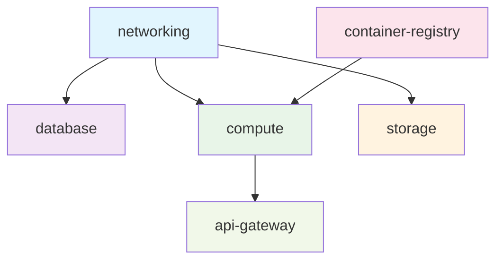

# 🏗️ Modular Terraform Structure

## 📁 Directory Structure

```
terraform/
├── main.tf                    # Root module - orchestrates everything
├── variables.tf               # Root level variables
├── outputs.tf                # Root level outputs
├── terraform.tfvars.example   # Example values
├── versions.tf               # Provider versions
├── locals.tf                 # Local values and computed data
│
├── modules/
│   ├── networking/
│   │   ├── main.tf           # VPC, subnets, gateways
│   │   ├── variables.tf      # Networking variables
│   │   ├── outputs.tf        # Networking outputs
│   │   └── security-groups.tf # Security groups
│   │
│   ├── database/
│   │   ├── main.tf           # RDS PostgreSQL
│   │   ├── variables.tf      # Database variables
│   │   ├── outputs.tf        # Database outputs
│   │   └── subnet-group.tf   # DB subnet group
│   │
│   ├── storage/
│   │   ├── main.tf           # S3 buckets
│   │   ├── variables.tf      # Storage variables
│   │   ├── outputs.tf        # Storage outputs
│   │   ├── s3-data-sources.tf    # Private bucket
│   │   ├── s3-profile-avatars.tf # Public bucket
│   │   └── dynamodb.tf       # DynamoDB tables
│   │
│   ├── compute/
│   │   ├── main.tf           # Lambda function
│   │   ├── variables.tf      # Compute variables
│   │   ├── outputs.tf        # Compute outputs
│   │   ├── lambda.tf         # Lambda configuration
│   │   ├── iam.tf            # IAM roles and policies
│   │   └── function-url.tf   # Lambda Function URL
│   │
│   ├── container-registry/
│   │   ├── main.tf           # ECR repository
│   │   ├── variables.tf      # ECR variables
│   │   ├── outputs.tf        # ECR outputs
│   │   └── lifecycle.tf      # ECR lifecycle policies
│   │
│   └── api-gateway/          # Optional API Gateway
│       ├── main.tf           # API Gateway resources
│       ├── variables.tf      # API Gateway variables
│       ├── outputs.tf        # API Gateway outputs
│       └── deployment.tf     # API Gateway deployment
│
└── environments/
    ├── dev/
    │   ├── main.tf           # Dev environment config
    │   ├── terraform.tfvars  # Dev-specific values
    │   └── backend.tf        # Dev backend config
    ├── staging/
    │   ├── main.tf           # Staging environment config
    │   ├── terraform.tfvars  # Staging-specific values
    │   └── backend.tf        # Staging backend config
    └── prod/
        ├── main.tf           # Production environment config
        ├── terraform.tfvars  # Production-specific values
        └── backend.tf        # Production backend config
```

## 🎯 Key Benefits of This Structure

### ✅ **Separation of Concerns**
- Each module handles one specific aspect
- Easy to test individual components
- Clear ownership and responsibility

### ✅ **Reusability**
- Modules can be used across environments
- Standardized configurations
- Version-controlled modules

### ✅ **Maintainability**
- Small, focused files
- Easy to understand and modify
- Clear dependencies between components

### ✅ **Environment Management**
- Separate configurations per environment
- Environment-specific values
- Consistent infrastructure across stages

## 🔄 Module Dependencies



## 📋 Implementation Strategy

### **Phase 1: Create Module Structure**
1. Set up directory structure
2. Create basic module templates
3. Define module interfaces (variables/outputs)

### **Phase 2: Migrate Resources**
1. Move resources to appropriate modules
2. Update variable references
3. Test each module independently

### **Phase 3: Environment Setup**
1. Create environment-specific configurations
2. Set up remote state management
3. Implement CI/CD integration

## 🚀 Next Steps

Let's start by creating the modular structure. I'll provide you with:

1. **Root configuration** that orchestrates modules
2. **Individual modules** for each component
3. **Environment templates** for different stages
4. **Best practices** for variable naming and outputs

This approach will make your infrastructure:
- **Easier to maintain** 🔧
- **More secure** 🛡️
- **Environment-ready** 🌍
- **Team-friendly** 👥